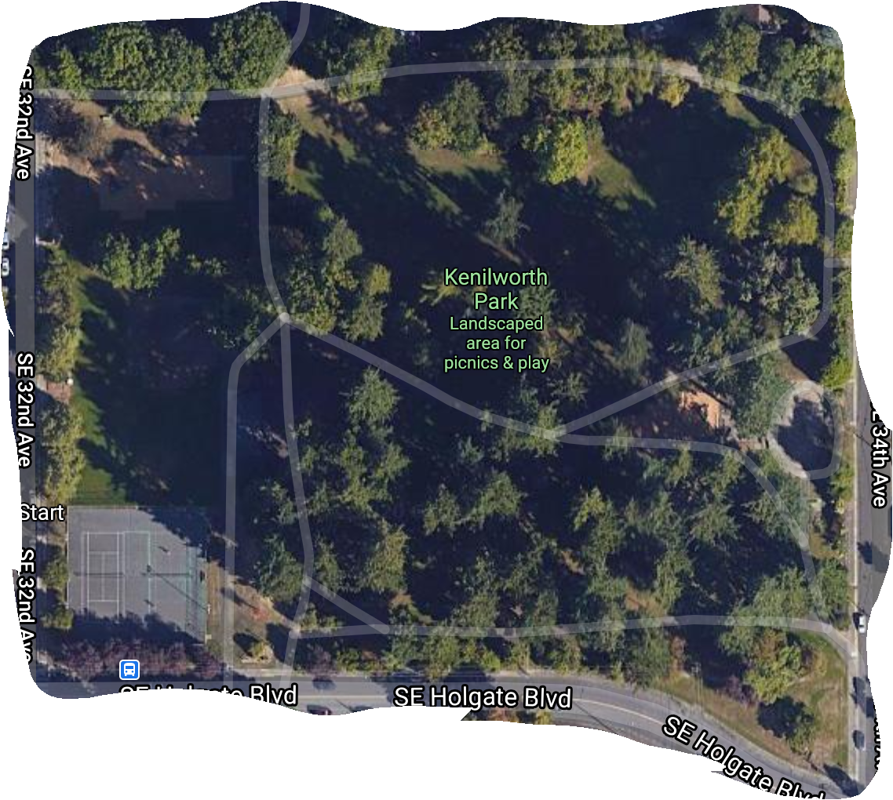

```{r setup, include=FALSE}
# Do not modify this chunk.
knitr::opts_chunk$set(echo = TRUE, message = FALSE, warning = FALSE, fig.retina = 2)
```


# Due: Before your Week 4 lab meeting

# Goals of this lab

* Continue practicing mapping the data to `geom`s using `ggplot2`.
* Learn some new `geom`s.
* Practice wrangling data.
* Explore editorial choices in graphs, such as color palettes.
* Draw conclusions from data visualizations.


## Problems

* For each problem, put your solution between the bars of stars.
* For this lab, you don't need to worry about labels and a title for your plots.
* Run the following chunk to load the necessary packages.


```{r}
# Load the necessary packages
library(tidyverse)
library(dplyr)
library(ggplot2)
library(pdxTrees)
```


**For Problems 1 - 5, we are going to use data from the `pdxTrees` package.**  In particular, we will use the dataset called `near_reed` that I create below.  This dataset includes the trees from four parks that are close to Reed.


Make sure to run the following R chunk.

```{r}
# Grab trees near Reed
near_reed <- get_pdxTrees_parks(park = 
                                  c("Crystal Springs Rhododendron Garden",
                                          "Kenilworth Park",
                                          "Eastmoreland Garden",
                                          "Berkeley Park"))

#Remove trees with no functional type
near_reed <- drop_na(near_reed, Functional_Type)
```


### Problem 1


a. Create a bar plot of `park`.


```{r}
# Bar plot
ggplot(data = near_reed, mapping = aes(x = Park)) + geom_bar()

```


b. Add the following layer to flip the axes.


```{r, eval = TRUE}
# Bar plot with flipped axes
ggplot(data = near_reed, mapping = aes(x = Park)) + geom_bar() +
  coord_flip()
```

c. Now let's reorder the bars to make it easier to compare the number of trees in the parks.  The function `fct_infreq()` will reorder the categories by their frequencies.  After reordering `park`, recreate the bar plot and draw some conclusions from your graph.


```{r}
# Change the order of park
near_reed <- mutate(near_reed, re_ordered_park = fct_infreq(Park))

ggplot(data = near_reed, mapping = aes(x = re_ordered_park)) +
  geom_bar() +   coord_flip() # Bar plot

```


*************************************************

+ Eastmoreland Garden has the fewest number of trees (~15)
+ Crystal Springs Rhododendron Garden has the most at approximatley 300.
+ Average of 165 trees per park

*************************************************

d. Create a two bar plots of `park` and `functional_type`:
    + For first one, display the proportions of each of the functional types for each park.
    + For the second one, display the counts of the each functional type for each park where the bars are dodged.

Compare and contrast the information provided in the two plots.


```{r}
# Bar plot: conditional proportions
ggplot(data = near_reed, mapping = aes(x=Park, fill =Functional_Type)) +
  geom_bar(position="fill") +
  theme(axis.text.x = element_text(angle = 60, hjust = 1))

 # Bar plot
```

```{r}
# Bar plot: dodged counts
ggplot(data = near_reed, mapping = aes(x=Park, fill =Functional_Type)) +
  geom_bar(position="dodge") +
  theme(axis.text.x = element_text(angle = 60, hjust = 1))

```

*************************************************

+ Proportions 
    * Pros: Simple to conclude what species dominate an area 
    * Cons: No sense of count
+ Doged counts
    * Pros: Sense of how many of each type of tree
    * Cons: Difficult to tell the proportions for certain parks, difficult to analyze for Eastmoreland Garden.
    
*************************************************

e. Draw some conclusions from your graphs in d. (Use `?get_pdxTrees_parks` to see what the `functional_type` categories represent.)

*************************************************
```{r, eval=FALSE}
?get_pdxTrees_parks
```
**Functional_Type:**
*Categorical variable with groups: Broadleaf Deciduous (BD), Broadleaf Evergreen (BE), Coniferous Deciduous (CD), and Coniferous Evergreen (CE)*

+ Represents what type of tree is in each park  

*************************************************

f. In class, we saw that you can change the color of a `ggplot2` barplot using `scale_fill_manual()`.  Another option involves adding the following layer to a `ggplot`:  

```{r, eval=FALSE}
ggplot(data = near_reed, mapping = aes(x=Park, fill =Mature_Size)) +
  geom_bar(position="fill") +
  theme(axis.text.x = element_text(angle = 60, hjust = 1)) +
  scale_fill_brewer(type = "qual", palette = 3)
```


Make several graphs of `park` and `mature_size` and try different palette types ("div", "seq", "qual") and colors (typically 1-9).  You may also want to use the `fct_relevel()` function to reorder the categories of one of the variables.

In your lab, include the graph that best displays the information.  Give the graph nice axis labels and a title.

```{r}
ggplot(data = near_reed, mapping = aes(x=Park, fill =Mature_Size)) +
  geom_bar(position="fill") +
  theme(axis.text.x = element_text(angle = 60, hjust = 1)) +
  scale_fill_brewer(type = "qual", palette = 3) +
  scale_y_continuous(labels = scales::percent) 
```


g. Justify the color palette you selected in f.

*************************************************
+ I am red greed colorblind. Blues and greens are a lot nicer. 
+ I changed it to percentages
+ I tried to change the legend. That did not work.


*************************************************


### Problem 2

a. Create a scatterplot of the longitude and latitude of the trees, colored by park.  Make the points somewhat transparent.


```{r}
# Scatterplot
ggplot(data=near_reed, mapping = aes(x=Longitude, y=Latitude, color=Park)) +
  geom_point(alpha=0.5) +
  scale_fill_brewer(type = "qual", palette = 3)
```

b. Describe what can be learned about these parks from the plot in a.


*************************************************
+ Density of trees 
+ Relations of parks to one another


*************************************************


c. Let's focus just on the trees in Kenilworth.  Create a plot of the longitude and latitude of the Kenilworth trees and color by tree height.


```{r}
# Create a dataset of only the trees in Kenilworth

Kenilworth <- filter(near_reed, Park=="Kenilworth Park")

# Scatterplot
ggplot(data=Kenilworth, mapping = aes(x=Longitude, y=Latitude)) + 
  geom_point(alpha=0.5) +
  scale_fill_brewer(type = "qual", palette = 3)
```

d.  Compare your plot to the [Google Maps Satellite view](https://www.google.com/maps/@45.4917128,-122.6318147,303m/data=!3m1!1e3) of Kenilworth Park.  In what way(s) do these two visualizations agree?  What information is easier to glean from your plot and what is easier to glean from the Google Map?

*************************************************
#


+ The graph and data points line up fairly consistently.
+ Difficult to tell what trees are underneath the canopy, advantage of the plot.
+ Diffucult to tell the larger trree from the plot

*************************************************


### Problem 3

a. Create a histogram of `Tree_Height`.

```{r}
# Histogram
ggplot(data=near_reed, mapping = aes(x=Tree_Height)) + geom_histogram()
```

b. Comment on the shape of the distribution of tree heights.

*************************************************
+ Appears to be several bell curves, likely because there are several types of trees. No set center, ranges from 0 to 150


*************************************************


c. Now we want to incorporate `functional_type` into the graph of `tree_height.`  I want you to create three graphs that each incorporate `functional_type` differently:

* Facet on `functional_type`.
* Add `functional_type` as the fill aesthetic.
* Try a new geom: `geom_freqpoly()` which Hadley describes as "basically a `geom_histogram()`" drawn with lines.  For this geom, map `functional_type` to the color of the lines.


```{r}
ggplot(data=near_reed, mapping = aes(x=Tree_Height, color=Functional_Type)) + geom_freqpoly()
```

d. From c, pick the graph that is most effective for comparing the tree heights by functional type.  Re-create that graph but fix the labels.  (Note: We will assume tree height is in feet.)


```{r}
ggplot(data=near_reed, mapping = aes(x=Tree_Height, color=Functional_Type)) + geom_freqpoly()
```


e. Justify why the graph you selected in d is most effective for comparing the tree heights by functional type.

*************************************************

+ Easier to tell apart the hists. More a line, less a jumbled mess of blining taylor.

*************************************************

### Problem 4

a. Create a boxplot of `Structural_Value` where `Native` is mapped to the x location and `Park` is mapped to color.  Add labels and a title to your plot.  (Leave the NA's in your graph.)


```{r}
# Boxplot of structural value by native and park

ggplot(data=near_reed%>%drop_na(Native), mapping = aes(Native, Structural_Value, color=Park)) + geom_boxplot()

```
*Dropped NA*

b. Although the graph contains the medians, let's also compute both the median and mean of monetary value by `Native` and `Park`, sorted by the highest mean to lowest mean.

```{r}
summary_native <- near_reed %>%
  drop_na(Native)%>%
  group_by(Native, Park) %>%
  summarize(mean_struct_val=mean(Total_Annual_Services), median_struct_val=median(Total_Annual_Services)) 

summary_native <- summary_native[order(-summary_native$mean_struct_val),]
summary_native
  
```


c. Draw some conclusions from your plot and summary statistics.

*************************************************
+ *Assumed* `Total_Annual_Services` *was what the question was looking for*
+ `Crystal Springs` Rhododendron Garden` has no non-native plants
+ Native plants are worth more on avarage.
+ `Eastmoreland Garden` skews right because it has fewer trees.
+ Mean is greater than the median for every park, likely all skew right due to trees that offer more value than others

*************************************************


### Problem 5

Each part of this problem will ask you to wrangle the data to answer a question.  Make sure to print the wrangled data frame and answer the question.  We provide part (a) as an example.

a. Find the tallest tree(s) from these parks near Reed and determine its height, diameter at breast height, common name, and the park where it is located.  What is the height of the tallest tree?

```{r}
# Tallest tree data frame
tallest <- near_reed %>%
  filter(Tree_Height == max(Tree_Height)) %>%
  select(Tree_Height, DBH, Common_Name, Park)

# Print wrangled data frame
tallest
```

*************************************************

+ The tallest tree is 153 feet tall! (*why was this already in here?*)
+ 41.4 and 35.7 `DBH`
+ At `Crystal Springs Rhododendron Garden` and `Kenilworth`
+ Both douglas Firs

*************************************************


b. **For each of the four parks**, find the tallest tree and determine its height, diameter at breast height, common name, and the park where it is located.  Are all of the tallest trees in these parks Douglas-Fir?  If not, what other types do we have?


```{r}
# Tallest tree by park data frame 
tall_by_park <- near_reed %>%
  group_by(Park) %>%
  filter(Tree_Height == max(Tree_Height)) %>%
  select(Tree_Height, DBH, Common_Name, Park)

tall_by_park

```


*************************************************

+ **NO!**, `Eastmoreland Garden` is proud to have an itty bitty Sweetgum. The rest are douglas firs

*************************************************


c. For each of the four parks, compute 2 measures of center and a measure of variability for tree height.  Which park's trees are tallest, on average?  Which park has the most variable tree heights?  Justify your answers.


```{r}
# Summary stats by park

height_summary <- near_reed %>%
  group_by(Park) %>%
  summarize(mean_height=mean(Tree_Height), median_tree=median(Tree_Height), standard_dev=sd(Tree_Height))

# Print summary stats by park

height_summary

```

*************************************************

+ Berkely Park
    * **Park with the largest median height**
    * 2nd smallest standard deviatian.
    * 2nd tallest average height
+ Crystal Springs Rhododendron Garden
    * Park with the third tallest median height
    * 2nd highest standard deviatian. 
    * 3rd tallest average height
+ Eastmoreland Garden
    * _Park with the shortest median height_
    * _Park smallest standard deviatian._
    * _Park with shortest average height_
+ Crystal Springs Rhododendron Garden
    * Park with the third tallest median height
    * **Largest standard deviatian.**
    * **tallest average height**
+ Conclusion
    * Berkely park has the tallest trees on average as Crystal Park has a large standard deviation

    
*************************************************

d. Produce a graphic that showcases the tree heights by park. (No need to worry about labels).  Use this graph to help explain the summary statistic comparisons you made in (c).


```{r}

ggplot(data=near_reed, mapping = aes(Park, Tree_Height)) + geom_boxplot() +coord_flip()

#ggplot(data=near_reed, mapping = aes(x=Tree_Height, fill=Park)) + geom_bar()
```


*************************************************

Although berkely soes not have the largest trees, it is the only park that skews left. In addition, it has the tallest Q1 and a small IQR so it's spread is closer to the center. 


*************************************************


e. Produce a data frame that contains the number of trees of each species (using `Common_Name`) by park, arranged in descending order by frequency.  Which is the most frequent species-park combination?  (It is okay to only display the first ten rows.)

```{r}
tree_park <- near_reed %>%
  group_by(Park, Common_Name)%>%
  summarize(count_trees = n())

tree_park <- tree_park[order(-tree_park$count_trees),]

tree_park[1:10,]
```

*************************************************


`Douglas-Fir` at *Crystal Springs Rhododendron Garden*. 93 trees


*************************************************

f. From these four parks, find all the trees that meet the following criteria:
    + Are Douglas-Fir or Northern Red Oak
    + Are at least 70 feet tall
    + Are in good condition

For those trees, provide their height, common name, and the park where it is located.  How many trees matched the criteria?

```{r}
# Trees matching several conditions
picky_trees <- near_reed %>%
  filter(Common_Name== "Douglas-Fir" | Common_Name=="Northern Red Oak", 
         Tree_Height>=70,
         Condition=="Good") %>%
  select(Tree_Height, Common_Name, Park)

```

*************************************************

+ Three trees

*************************************************


g. We can (very roughly) estimate the age of a tree using the following calculation:  

DBH (inches) × Growth Factor = Estimated Age of Tree (years)

For Douglas-Fir, the growth factor is 5.  For the Douglas-Fir in Berkeley Park, compute their estimated age and create a data frame that contains the estimated age, height, and diameter.  Arrange the data frame from youngest to oldest.  Based on our rough calculation, how old is the youngest Douglas-Fir in Berkeley Park?

```{r}
Berkeley_age <- near_reed %>%
  filter(Common_Name== "Douglas-Fir",
  Park=="Berkeley Park") %>%
  mutate(Tree_age = DBH*5)
  
Berkeley_age
```


*************************************************

+ 167 to 261 years old

*************************************************


### Problem 6

It is time for each of you to create your own version of [our favorite Anne Hathaway graph](https://fivethirtyeight.com/features/the-three-types-of-anne-hathaway-movies/), or the Anne Graphaway as Margot calls it.  For an actor of your choice (can't be Anne Hathaway), we want you to create a scatterplot of Rotten Tomatoes rating and Box office gross where the points are colored by a categorical variable of your choosing.

a. Which actor will you be graphing?

*************************************************

Tom Holland, for reasons.

 
*************************************************

b.  Beyond Rotten Tomatoes rating and Box office gross, what is your third variable?  Note: It should be a variable you can collect online or can be defined by the user.

*************************************************

Accent
 
*************************************************


c. Create the data frame for your actor and include at least 10 movies.  To show you how to create your own data frame in R, we have included an example that contains 4 Ryan Gosling movies.

Notes:

* Rotten Tomatoes ratings and Box Office can be found [here](https://www.rottentomatoes.com/celebrity/tom_holland).

```{r}
holland <- data.frame(
  movie = c("The Impossible", 
            "How I Live Now",
            "Locke", 
            "Captain America: Civil War",
            "The Lost City of Z",
            "Spider-Man: Homecoming",
            "Avengers: Infinity War",
            "Avengers: Endgame",
            "Spider-Man: Far From Home",
            "The Current War: Director's Cut",
            "Spies in Disguise",
            "Dolittle",
            "Onward",
            "In the Heart of the Sea"),
  rotten_tomatoes = c(81, 66, 91, 91, 86, 92, 85, 94, 90, 61, 75, 14, 88, 43),
  box_office = c(19, 0.06, 1.4, 408.1, 8.6, 334.2, 665, 2798, 1132, 12.3, 171.6, 249.7, 135.5, 23.06),
  Accent = c("British", "British", "British", "American", "British", "American", 
             "American", "American", "American", "British", "American", "British", "American", "American")
)

```

d. Construct your graph.  Moving beyond the default `ggplot2` colors, use the `scale_color_manual()` layer to set the colors yourself.

```{r}
  ggplot(data=holland, mapping = aes(rotten_tomatoes, box_office, color=Accent)) + 
  geom_point() +
    scale_colour_manual(values=c("blue", "red"))

```

e. Let's add a bit more context to our graph.  If you haven't already, add nice labels, a title, and a caption with the data source.  Also let's label the movies in the graph.  Here's some code to get you started.  Make sure to insert the appropriate layers.

```{r, eval=TRUE}
# Contains the geom_text_repel() layer
library(ggrepel)
#Helpful r code:  add in the base layer and geom layer
ggplot(data=holland, mapping = aes(rotten_tomatoes, box_office, color=Accent)) + 
  scale_colour_manual(values=c("blue", "red")) +
  scale_shape_manual(values=c(23, 22))+
  geom_text_repel(aes(label = movie), size = 4) +
  xlab("Rotten Tomato %") +
  ylab("Box Office")+
  ggtitle("Tom Hollands and his Adorable Accent")+
  geom_point()

```


f. Draw some conclusions about the relationships between box office gross, ratings, and your third variable.  What does this tell us about your actor?


*************************************************

+ When Tom Holland uses his British accent, there is a small box office. In addition, there is a wide spread in the ratings.

+ When Tom Holland uses his American accent there is a high rotten tomato score, and a large spread for the box office. 
+ The box office is typically greater for films where he uses his American accent.
+ These are coorelations, not causations. Films that require American actors may have larger budgets
+ Negative coorelation
 
*************************************************
